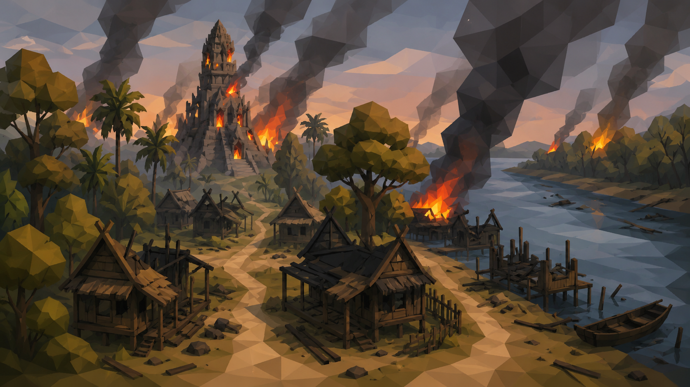

# Khun Phrai Game Project
โปรเจกต์เกม Souls-like Survival ในโลกของวรรณคดีไทย

# Project Overview
- **My Role:** Game Designer / Level Designer / System Designer
- **Engine & Tools:** Unity Engine / Blender(3D Asset Design)
- **Genre & Platform:** Souls-like Survival (PC)
- **Project Status:** Work In Progress

# World Setting

ในยุคสมัยของ Yautaya (ได้รับแรงบันดาลใจมาจากวรรณคดีเรือง ขุนช้างขุนแผน) เป็นช่วงทีบ้านเมืองระสําระสายจนได้เกิดเปน **“สงครามแห่งอาคมมืด”** กองทัพจากต่างเมืองใช้วิชาไสยศาสตร์ดํารวบรวม **"พลังงานวิญญาณ"** ของชาวบ้านเพือทําพิธีกรรมมืด ทําให้สภาพแวดล้อมเต็มไปด้วยหมู่บ้านทีถูกทําลาย และป่าเต็มไปด้วยโจรคนตายไม่ไปผุดไปเกิด วิญญาณเร่ร่อนเพราะแรงอาฆาต

# Story
ท่ามกลางไฟสงครามทีคุกรุ่นระหว่างอาณาจักร **"พราย"** ชาวบ้านธรรมดาต้องเผชิญกับโศกนาฏกรรมครังใหญ่ เมือหมู่บ้านถูกกองทัพทหารต่างเมืองบุกโจมตี พรายบาดเจ็บสาหัสและชาวบ้านถูกจับไปเป็นเชลยท่ามกลางความโกลาหลนั้น ขุนแผนได้ปรากฏตัวขึนและช่วยชีวิตพรายไว้ได้ พรายจึงได้ขอเป็นผู้ติดตามของขุนแผนเพือเป็นการตอบแทนบุญคุณของขุนแผนที่ช่วยชีวิตของเขาไว้และเพือแก้แค้นให้กับคนในหมู่บ้านของเขา

# Game Mechanics & System Design
- **Core Gameplay Loop:** 
- **Systems Design:**
  > ระบบ Day/Night 
  > ระบบ Era Progression 
  > ระบบ Economy 
- **Quest & Narrative Architecture:**
  > โครงสร้างเควสหลัก/ย่อย

# Link
- [Intro Video](https://youtu.be/CqWHmPapPRg?si=aEk3hbZCRT6qAFp-)
